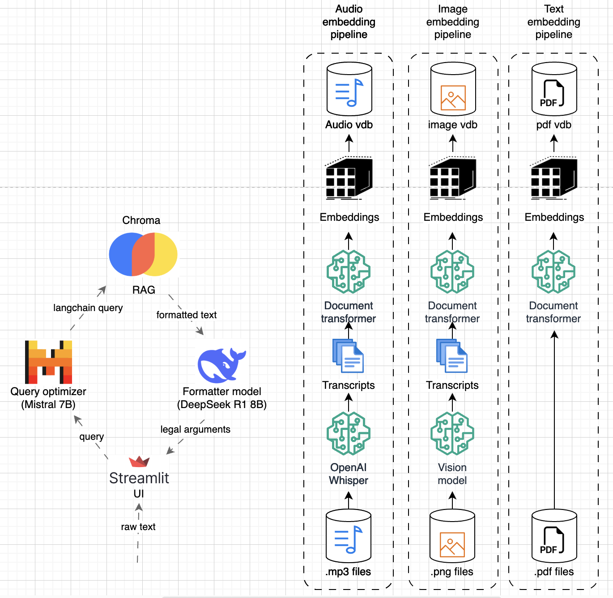

# Multi-Agent Legal RAG for Multimodal Input
*Capstone project for comp.cs.530 (Fine-tuning LLMs)*

## Project Overview

This repository contains a **multimodal legal RAG (Retrieval-Augmented Generation) system** designed to handle audio, text, and image-based legal documents. The project leverages vector databases to store and index these diverse data sources for efficient retrieval. A **multi-agent workflow** orchestrates the process:

- A **Query Optimizer** refines user queries to improve retrieval precision.
- A **Formatter** synthesizes the retrieved material into coherent legal arguments or responses.

By unifying specialized models and databases, this system delivers context-rich, accurate, and well-structured legal information through a user-friendly interface.


## Project Architecture


## Data
### Datasets
#### [Project Oyez](https://www.oyez.org/)

The **Project Oyez dataset** provides access to audio recordings and detailed metadata from U.S. Supreme Court oral arguments via the Oyez API. The dataset includes:

- High-quality MP3 audio recordings of Supreme Court oral arguments.
- Extensive metadata, including case names, docket numbers, dates, participating justices, advocates, transcripts, and summaries.

This dataset is particularly valuable for a **legal Retrieval-Augmented Generation (RAG)** system, as it provides:

- Rich primary-source content ideal for retrieving authoritative references and contextual examples for legal arguments.
- High-quality transcripts and audio content enabling precise retrieval and nuanced language modeling.
- Detailed metadata supporting accurate semantic searches, significantly improving the system's ability to generate contextually relevant and legally informed responses.

#### [Harvard Caselaw](https://case.law/)

The **Harvard Caselaw dataset** provides comprehensive access to U.S. caselaw documents via the Harvard Caselaw Access Project (CAP) API. The dataset includes:

- Full-text caselaw documents from various jurisdictions and historical periods.
- Extensive metadata, such as case citations, decision dates, court names, judges, and detailed case summaries.

This dataset is especially useful for a **legal Retrieval-Augmented Generation (RAG)** system, as it offers:

- High-quality reference material for accurately retrieving contextually relevant caselaw documents.
- Rich metadata facilitating precise semantic searches and improved retrieval accuracy.
- Comprehensive historical coverage enabling nuanced responses to complex legal queries, enhancing the generation of robust and reliable legal arguments.

#### [Pile of Law](https://huggingface.co/datasets/pile-of-law/pile-of-law)

The **Pile of Law dataset** provides comprehensive textual resources for legal NLP applications. This project uses:

- **CourtListener Opinions**: Judicial opinions across various U.S. courts (for retrieval/RAG).
- **SCOTUS Filings**: Legal filings submitted to the U.S. Supreme Court (for retrieval/RAG).
- **r/legaladvice**: Real-world legal questions and responses from online interactions (used specifically for fine-tuning the DeepSeek chatbot).

This selection allows effective retrieval of authoritative legal references, combined with fine-tuning on real-world interactions to enhance the chatbot's practical responsiveness and accuracy.

### Preprocess Pipelines
- The project Oyez audio files are transcribed with [OpenAI Whisper](https://openai.com/index/whisper/). For more information, see `openai_whisper_pipeline.ipynb`.
- The Harvard caselaw PDFs are processed using [Google’s Tesseract](https://github.com/tesseract-ocr/tesseract) OCR to extract textual content. For more information, see `google_tesseract_pipeline.ipynb`.
- The text is stemmed and the stopwords are removed for before calculating embeddings for vector database. For more information, see `text_embedding_pipeline.ipynb`.
- All text pipelines remove unnecessary characters from the text, such as special characters, HTML tags, extra whitespace, and formatting artifacts, ensuring clean and consistent input for downstream processing.

## Dependencies

To run this project, you need **Docker** and the **Docker Compose** plugin. Follow the official [Docker documentation](https://docs.docker.com/engine/install/ubuntu/#install-using-the-repository) for step-by-step installation instructions on Ubuntu.

After installing Docker, grant your user account the necessary permissions:

```bash
sudo usermod -aG docker $USER
newgrp docker
```
This ensures you can run Docker commands without elevated privileges.

## How to Run?

From the project's root directory, run the following commands to build and launch the containers:

```bash
docker compose build
docker compose up
```
*Note for macOS users: Ensure Docker is running by executing*:
```bash
open -a Docker
```